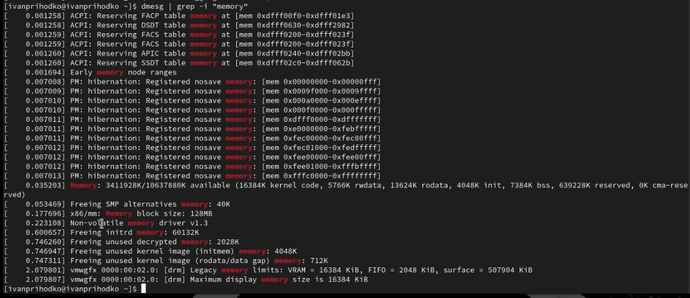

---
## Front matter
title: "Отчёт о лабораторной работе"
subtitle: "Лабораторная работа №1"
author: "Приходько Иван Иванович"

## Generic otions
lang: ru-RU
toc-title: "Содержание"

## Bibliography
bibliography: bib/cite.bib
csl: pandoc/csl/gost-r-7-0-5-2008-numeric.csl

## Pdf output format
toc: true # Table of contents
toc-depth: 2
lof: true # List of figures
lot: true # List of tables
fontsize: 12pt
linestretch: 1.5
papersize: a4
documentclass: scrreprt
## I18n polyglossia
polyglossia-lang:
  name: russian
  options:
	- spelling=modern
	- babelshorthands=true
polyglossia-otherlangs:
  name: english
## I18n babel
babel-lang: russian
babel-otherlangs: english
## Fonts
mainfont: IBM Plex Serif
romanfont: IBM Plex Serif
sansfont: IBM Plex Sans
monofont: IBM Plex Mono
mathfont: STIX Two Math
mainfontoptions: Ligatures=Common,Ligatures=TeX,Scale=0.94
romanfontoptions: Ligatures=Common,Ligatures=TeX,Scale=0.94
sansfontoptions: Ligatures=Common,Ligatures=TeX,Scale=MatchLowercase,Scale=0.94
monofontoptions: Scale=MatchLowercase,Scale=0.94,FakeStretch=0.9
mathfontoptions:
## Biblatex
biblatex: true
biblio-style: "gost-numeric"
biblatexoptions:
  - parentracker=true
  - backend=biber
  - hyperref=auto
  - language=auto
  - autolang=other*
  - citestyle=gost-numeric
## Pandoc-crossref LaTeX customization
figureTitle: "Рис."
tableTitle: "Таблица"
listingTitle: "Листинг"
lofTitle: "Список иллюстраций"
lotTitle: "Список таблиц"
lolTitle: "Листинги"
## Misc options
indent: true
header-includes:
  - \usepackage{indentfirst}
  - \usepackage{float} # keep figures where there are in the text
  - \floatplacement{figure}{H} # keep figures where there are in the text
---

# Цель работы

Установить Linux Rocky и ознакомиться с его возможностями

# Задание

Установить ОС и выполнить домашнее задание

# Выполнение лабораторной работы

Для начала подключаем диск операционной системы (рис. [-@fig:001]).

{#fig:001 width=70%}

Далее выделяем оперативную память и процессоры (рис. [-@fig:001]).

{#fig:002 width=70%}

Теперь выделяем память для виртуального жесткого диска (рис. [-@fig:003]).

{#fig:003 width=70%}

Далее запускам виртуальную машину и выставляем все нужные параметры (рис. [-@fig:004]).

{#fig:004 width=70%}

После установки нам предлагают узнать все данные об ОС (рис. [-@fig:005]).

{#fig:005 width=70%}

Далее узнаем частоту и модель процессора (рис. [-@fig:006]).

{#fig:006 width=70%}

Теперь доступную память (рис. [-@fig:007].

{#fig:007 width=70%}

И напоследок Hypervisior и файловую систему (рис. [-@fig:008]).

{#fig:008 width=70%}

# Выводы

В ходе данной лабораторной работы была успешно установлена и настроенная ОС Rocky

# Ответы на контрольные вопросы

1.
– Получение справки: man <команда> (например, `man ls`)  
– Перемещение по файловой системе: cd <путь>  
– Просмотр содержимого каталога: ls  
– Определение объёма каталога: du  
– Создание/удаление каталогов / файлов: mkdir, rmdir, rm  
– Задание прав: chmod, chown  
– Просмотр истории команд: history  

2. Учётная запись содержит: имя, UID, GID, домашний каталог, права доступа.  
Команды: whoami, id, finger (при наличии).  

3. Файловая система — структура данных для хранения файлов и папок. Примеры: ext4 (Linux), NTFS (Windows), APFS (macOS).  

4. Команда: mount или df -h.  

5. Удалить зависший процесс: kill <PID> или kill -9 <PID>.

