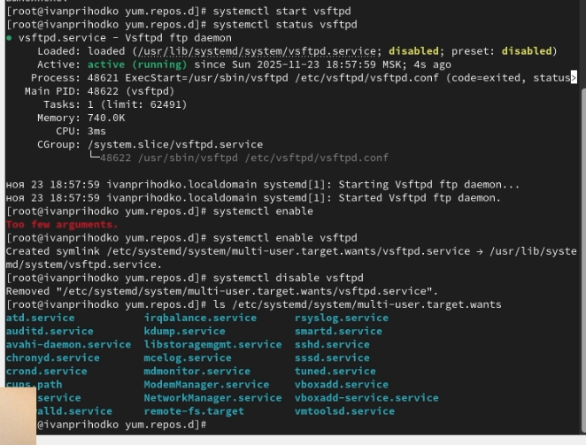

---
## Front matter
lang: ru-RU
title: Лабораторная работа
subtitle: Номер 5
author:
  - Приходько Иван Иванович
institute:
  - Российский университет дружбы народов, Москва, Россия
date: 27 ноября 2025

## i18n babel
babel-lang: russian
babel-otherlangs: english

## Formatting pdf
toc: false
toc-title: Содержание
slide_level: 2
aspectratio: 169
section-titles: true
theme: metropolis
header-includes:
 - \metroset{progressbar=frametitle,sectionpage=progressbar,numbering=fraction}
 
## Fonts
mainfont: IBM Plex Serif
romanfont: IBM Plex Serif
sansfont: IBM Plex Sans
monofont: IBM Plex Mono
mathfont: STIX Two Math
mainfontoptions: Ligatures=Common,Ligatures=TeX,Scale=0.94
romanfontoptions: Ligatures=Common,Ligatures=TeX,Scale=0.94
sansfontoptions: Ligatures=Common,Ligatures=TeX,Scale=MatchLowercase,Scale=0.94
monofontoptions: Scale=MatchLowercase,Scale=0.94,FakeStretch=0.9
mathfontoptions:
---

# Информация

## Докладчик

:::::::::::::: {.columns align=center}
::: {.column width="70%"}

  * Приходько Иван Иванович
  * Студент
  * Российский университет дружбы народов

:::
::: {.column width="30%"}

:::
::::::::::::::

## Цель работы

Получить навыки управления системными службами операционной системы посредством systemd.

## Задание

Научится управлять системными службами операционной системы посредством systemd

## Работа с systemd 

Для начаал установим systemd 

## Работа с systemd 

Далее активируем systemd и перезагруем машину 

## Работа с systemd 

Далее добавим службу Very Secure FTP в автозапуск и сразу же удалим оттуда 

## Работа с iptables 

Теперь установим iptables 

## Работа с iptables 

Он конфликтует с firewall, поэтому отключим его, далее попробуем замаскировать сеть и провзаимодействоввать с ней

## Работа с iptables 

Отключим iptables и включим firewall, а потом выведем список всех сетей которые можно изолировать 

## Работа с целями

Теперь поработаем с целями 

## Работа с целями

После этого система запустилась в текстовом режиме, попробуем вернуть снова в графический 

## Выводы

В ходе данной лабораторной работы были получены знания для управления системными службами операционной системы посредством systemd.

