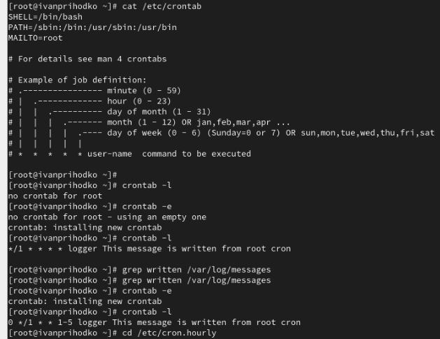

---
## Front matter
lang: ru-RU
title: Лабораторная работа
subtitle: Номер 8
author:
  - Приходько Иван Иванович
institute:
  - Российский университет дружбы народов, Москва, Россия
date: 27 ноября 2025

## i18n babel
babel-lang: russian
babel-otherlangs: english

## Formatting pdf
toc: false
toc-title: Содержание
slide_level: 2
aspectratio: 169
section-titles: true
theme: metropolis
header-includes:
 - \metroset{progressbar=frametitle,sectionpage=progressbar,numbering=fraction}
 
## Fonts
mainfont: IBM Plex Serif
romanfont: IBM Plex Serif
sansfont: IBM Plex Sans
monofont: IBM Plex Mono
mathfont: STIX Two Math
mainfontoptions: Ligatures=Common,Ligatures=TeX,Scale=0.94
romanfontoptions: Ligatures=Common,Ligatures=TeX,Scale=0.94
sansfontoptions: Ligatures=Common,Ligatures=TeX,Scale=MatchLowercase,Scale=0.94
monofontoptions: Scale=MatchLowercase,Scale=0.94,FakeStretch=0.9
mathfontoptions:
---

# Информация

## Докладчик

:::::::::::::: {.columns align=center}
::: {.column width="70%"}

  * Приходько Иван Иванович
  * Студент
  * Российский университет дружбы народов

:::
::: {.column width="30%"}

:::
::::::::::::::

## Цель работы

Получение навыков работы с планировщиками событий cron и at.

## Задание

Поработать с планировщиком событий cron и at.

## Работа с расписанием

Для начала выведем статус cron

## Работа с расписанием

Добавим сообщение в корневой файл

## Работа с расписанием

Теперь посмотрим список расписаний и выведем наши сообщения

## Работа с расписанием

Создадим расписание на каждый час

## Выводы

В ходе данной лабораторной работы были получены навыки для работы с планировщиками событий cron и at.

