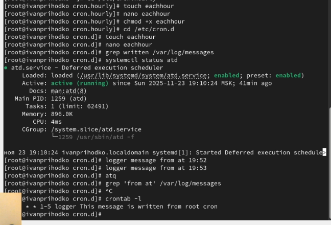

---
## Front matter
title: "Отчёт о лабораторной работе"
subtitle: "Лабораторная работа №8"
author: "Приходько Иван Иванович"

## Generic otions
lang: ru-RU
toc-title: "Содержание"

## Bibliography
bibliography: bib/cite.bib
csl: pandoc/csl/gost-r-7-0-5-2008-numeric.csl

## Pdf output format
toc: true # Table of contents
toc-depth: 2
lof: true # List of figures
lot: true # List of tables
fontsize: 12pt
linestretch: 1.5
papersize: a4
documentclass: scrreprt
## I18n polyglossia
polyglossia-lang:
  name: russian
  options:
	- spelling=modern
	- babelshorthands=true
polyglossia-otherlangs:
  name: english
## I18n babel
babel-lang: russian
babel-otherlangs: english
## Fonts
mainfont: IBM Plex Serif
romanfont: IBM Plex Serif
sansfont: IBM Plex Sans
monofont: IBM Plex Mono
mathfont: STIX Two Math
mainfontoptions: Ligatures=Common,Ligatures=TeX,Scale=0.94
romanfontoptions: Ligatures=Common,Ligatures=TeX,Scale=0.94
sansfontoptions: Ligatures=Common,Ligatures=TeX,Scale=MatchLowercase,Scale=0.94
monofontoptions: Scale=MatchLowercase,Scale=0.94,FakeStretch=0.9
mathfontoptions:
## Biblatex
biblatex: true
biblio-style: "gost-numeric"
biblatexoptions:
  - parentracker=true
  - backend=biber
  - hyperref=auto
  - language=auto
  - autolang=other*
  - citestyle=gost-numeric
## Pandoc-crossref LaTeX customization
figureTitle: "Рис."
tableTitle: "Таблица"
listingTitle: "Листинг"
lofTitle: "Список иллюстраций"
lotTitle: "Список таблиц"
lolTitle: "Листинги"
## Misc options
indent: true
header-includes:
  - \usepackage{indentfirst}
  - \usepackage{float} # keep figures where there are in the text
  - \floatplacement{figure}{H} # keep figures where there are in the text
---

# Цель работы

Получение навыков работы с планировщиками событий cron и at.

# Задание

Поработать с планировщиком событий cron и at.

# Выполнение лабораторной работы

Для начала выведем статус cron (рис. [3.1]).

{#fig:001 width=70%}

Добавим сообщение в корневой файл (рис. [3.2]).

{#fig:002 width=70%}

Теперь посмотрим список расписаний и выведем наши сообщения (рис. [3.3]).

{#fig:003 width=70%}

Создадим расписание на каждый час (рис. [3.4]).

{#fig:004 width=70%}

# Выводы

В ходе данной лабораторной работы были получены навыки для работы с планировщиками событий cron и at.

# Ответы на контрольные вопросы

1. Ограничениями cron не предусмотрено выполнение раз в 2 недели

2. 0 2 1,15 * * /команда  

3. */2 * * * * /команда  

4. 0 0 19 9 * /команда  

5. 0 0 * 9 4 /команда

6. crontab -u alice -e — откроется редактор для редактирования заданий пользователя alice.  

7. Добавить его в /etc/cron.deny или /etc/cron.allow — оставить файл /etc/cron.allow пуст или без этой учетной записи.  

8. Использовать @daily в cron или настроить systemd-timer с опцией Persistent=true, чтобы запускать задачу с автоматической проверкой.  

9. systemctl list-timers — показывает запланированные задачи таймеров.
