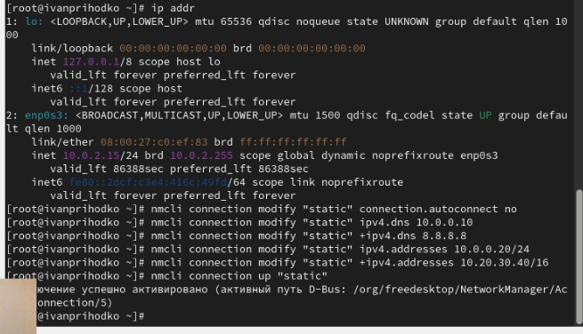

---
## Front matter
title: "Отчёт о лабораторной работе"
subtitle: "Лабораторная работа №12"
author: "Приходько Иван Иванович"

## Generic otions
lang: ru-RU
toc-title: "Содержание"

## Bibliography
bibliography: bib/cite.bib
csl: pandoc/csl/gost-r-7-0-5-2008-numeric.csl

## Pdf output format
toc: true # Table of contents
toc-depth: 2
lof: true # List of figures
lot: true # List of tables
fontsize: 12pt
linestretch: 1.5
papersize: a4
documentclass: scrreprt
## I18n polyglossia
polyglossia-lang:
  name: russian
  options:
	- spelling=modern
	- babelshorthands=true
polyglossia-otherlangs:
  name: english
## I18n babel
babel-lang: russian
babel-otherlangs: english
## Fonts
mainfont: IBM Plex Serif
romanfont: IBM Plex Serif
sansfont: IBM Plex Sans
monofont: IBM Plex Mono
mathfont: STIX Two Math
mainfontoptions: Ligatures=Common,Ligatures=TeX,Scale=0.94
romanfontoptions: Ligatures=Common,Ligatures=TeX,Scale=0.94
sansfontoptions: Ligatures=Common,Ligatures=TeX,Scale=MatchLowercase,Scale=0.94
monofontoptions: Scale=MatchLowercase,Scale=0.94,FakeStretch=0.9
mathfontoptions:
## Biblatex
biblatex: true
biblio-style: "gost-numeric"
biblatexoptions:
  - parentracker=true
  - backend=biber
  - hyperref=auto
  - language=auto
  - autolang=other*
  - citestyle=gost-numeric
## Pandoc-crossref LaTeX customization
figureTitle: "Рис."
tableTitle: "Таблица"
listingTitle: "Листинг"
lofTitle: "Список иллюстраций"
lotTitle: "Список таблиц"
lolTitle: "Листинги"
## Misc options
indent: true
header-includes:
  - \usepackage{indentfirst}
  - \usepackage{float} # keep figures where there are in the text
  - \floatplacement{figure}{H} # keep figures where there are in the text
---

# Цель работы

Получить навыки настройки сетевых параметров системы.

# Задание

Поработать с настройкой сетевых параметров системы.

# Выполнение лабораторной работы

Для начала выведем информацию обо всех сетевых подключениях (рис. [3.1]).

{#fig:001 width=70%}

Проверим подключение к интернету и добавим дополнительный адрес (рис. [3.2]).

{#fig:002 width=70%}

Проверим добавился ли адрес (рис. [3.3]).

{#fig:003
 width=70%}

Теперь поработаем с nmcli и поуправляем сетевыми подключениями (рис. [3.4]).

{#fig:004 width=70%}

Добавим сетевое подключение (рис. [3.5]).

{#fig:005 width=70%}

Далее попадаем в графические меню сетевых подлючений (рис. [3.6]).

{#fig:006 width=70%}

И теперь вернем первоначальное соеденение (рис. [3.7]).

{#fig:007 width=70%}

# Выводы

В ходе данной лабораторной работы были получены навыки для настройки сетевых параметров системы.

# Ответы на контрольные вопросы

1. nmcli general status или nmcli device status  

2. NetworkManager  

3. /etc/hostname (или вывод `hostnamectl`)  

4. hostnamectl set-hostname <имя_узла>  

5. /etc/hosts или /etc/ethers  

6. ip route  

7. systemctl status NetworkManager  

8. nmcli con mod <имя_подключения> ipv4.addresses <IP-адрес>/маска ipv4.gateway <шлюз>
