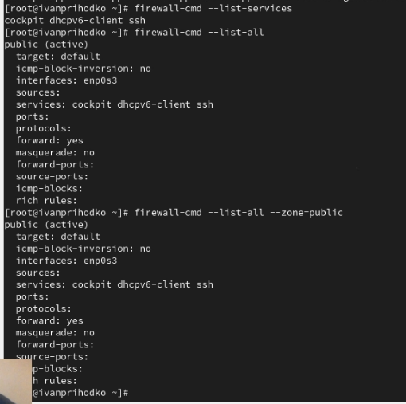

---
## Front matter
title: "Отчёт о лабораторной работе"
subtitle: "Лабораторная работа №13"
author: "Приходько Иван Иванович"

## Generic otions
lang: ru-RU
toc-title: "Содержание"

## Bibliography
bibliography: bib/cite.bib
csl: pandoc/csl/gost-r-7-0-5-2008-numeric.csl

## Pdf output format
toc: true # Table of contents
toc-depth: 2
lof: true # List of figures
lot: true # List of tables
fontsize: 12pt
linestretch: 1.5
papersize: a4
documentclass: scrreprt
## I18n polyglossia
polyglossia-lang:
  name: russian
  options:
	- spelling=modern
	- babelshorthands=true
polyglossia-otherlangs:
  name: english
## I18n babel
babel-lang: russian
babel-otherlangs: english
## Fonts
mainfont: IBM Plex Serif
romanfont: IBM Plex Serif
sansfont: IBM Plex Sans
monofont: IBM Plex Mono
mathfont: STIX Two Math
mainfontoptions: Ligatures=Common,Ligatures=TeX,Scale=0.94
romanfontoptions: Ligatures=Common,Ligatures=TeX,Scale=0.94
sansfontoptions: Ligatures=Common,Ligatures=TeX,Scale=MatchLowercase,Scale=0.94
monofontoptions: Scale=MatchLowercase,Scale=0.94,FakeStretch=0.9
mathfontoptions:
## Biblatex
biblatex: true
biblio-style: "gost-numeric"
biblatexoptions:
  - parentracker=true
  - backend=biber
  - hyperref=auto
  - language=auto
  - autolang=other*
  - citestyle=gost-numeric
## Pandoc-crossref LaTeX customization
figureTitle: "Рис."
tableTitle: "Таблица"
listingTitle: "Листинг"
lofTitle: "Список иллюстраций"
lotTitle: "Список таблиц"
lolTitle: "Листинги"
## Misc options
indent: true
header-includes:
  - \usepackage{indentfirst}
  - \usepackage{float} # keep figures where there are in the text
  - \floatplacement{figure}{H} # keep figures where there are in the text
---

# Цель работы

Получить навыки настройки пакетного фильтра в Linux.

# Задание

Поработать с пакетным фильтром в Linux.

# Выполнение лабораторной работы

Для начала посмотрим все доступные службы в текущей зоне (рис. [3.1]).

{#fig:001 width=70%}

Выведем немного подругому доступные службы (рис. [3.2]).

{#fig:002 width=70%}

Добавим VNC в конфигурацию брэндмауэр и проверим добавился ли он(рис. [3.3]).

{#fig:003 width=70%}

Только после перезагрузки он появился (рис. [3.4]).

{#fig:004 width=70%}

Проверим добавился ли VNC после перманентного добавления (рис. [3.5]).

{#fig:005 width=70%}

Теперь попробуем запустить графическое меню firewall (рис. [3.6]).

{#fig:006 width=70%}

Через графичесике меню добавляем серивисы, что просят в задании (рис. [3.7]).

{#fig:007 width=70%}

Проверим добавились ли они (рис. [3.8]).

{#fig:008 width=70%}

После перезагрузки компьютера проверим, были добавлены изменения после самостоятельной работы (рис. [3.9]).

{#fig:009 width=70%}

# Выводы

В ходе данной лабораторной работы были получены навыки для настройки пакетного фильтра в Linux.

# Ответы на контрольные вопросы

1. firewalld  

2. firewall-cmd --zone=public --add-port=2355/udp --permanent  

3. firewall-cmd --list-all  

4. firewall-cmd --remove-service=vnc-server --permanent  

5. firewall-cmd --reload  

6. firewall-cmd --zone=public --list-interfaces или firewall-cmd --list-all  

7. firewall-cmd --zone=public --add-interface=eno1 --permanent  

8. в зону по умолчанию (обычно `public`)
