---
## Front matter
lang: ru-RU
title: Лабораторная работа
subtitle: Номер 14
author:
  - Приходько Иван Иванович
institute:
  - Российский университет дружбы народов, Москва, Россия
date: 06 декабря 2025

## i18n babel
babel-lang: russian
babel-otherlangs: english

## Formatting pdf
toc: false
toc-title: Содержание
slide_level: 2
aspectratio: 169
section-titles: true
theme: metropolis
header-includes:
 - \metroset{progressbar=frametitle,sectionpage=progressbar,numbering=fraction}
 
## Fonts
mainfont: IBM Plex Serif
romanfont: IBM Plex Serif
sansfont: IBM Plex Sans
monofont: IBM Plex Mono
mathfont: STIX Two Math
mainfontoptions: Ligatures=Common,Ligatures=TeX,Scale=0.94
romanfontoptions: Ligatures=Common,Ligatures=TeX,Scale=0.94
sansfontoptions: Ligatures=Common,Ligatures=TeX,Scale=MatchLowercase,Scale=0.94
monofontoptions: Scale=MatchLowercase,Scale=0.94,FakeStretch=0.9
mathfontoptions:
---

# Информация

## Докладчик

:::::::::::::: {.columns align=center}
::: {.column width="70%"}

  * Приходько Иван Иванович
  * Студент
  * Российский университет дружбы народов

:::
::: {.column width="30%"}

:::
::::::::::::::

## Цель работы

Получить навыки создания разделов на диске и файловых систем. Получить навыки монтирования файловых систем.

## Задание

Научиться создавать разделы на диске и файловые системы, монтировать файловые системы.

## Создане жесткого диска

Для начала переходим в меню для добавления жестких дисков 

## Создане жесткого диска

Нажимаем добавить и затем выбираем тип файла VDI

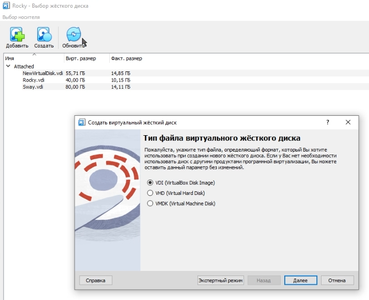

## Создане жесткого диска

Указываем имя и размер диска

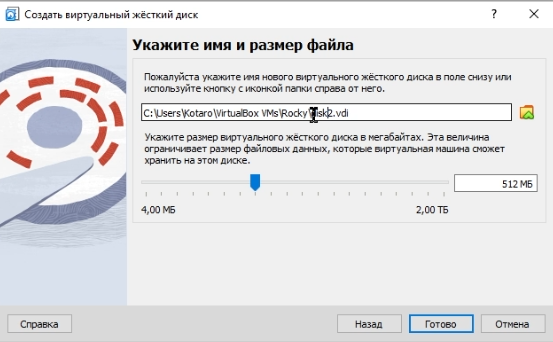

## Создане жесткого диска

Далее создаем второй такой же диск

## Создане жесткого диска

Внутри виртуальной машины видим, что диски успешно добавлены 

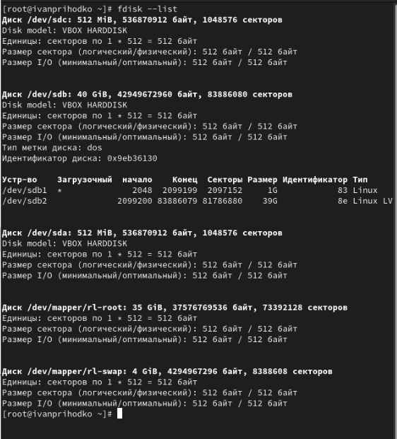

## Создание разделов

Далее создаем разметку для диска 1 

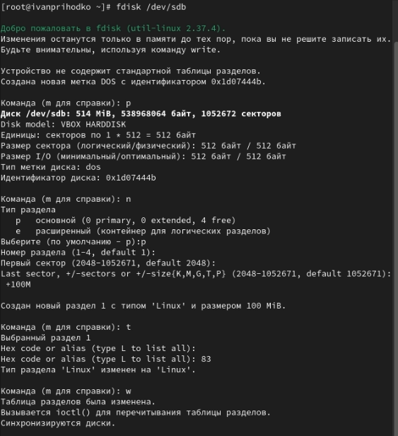

## Создание разделов

Проверям и видим, что все успешно создано 

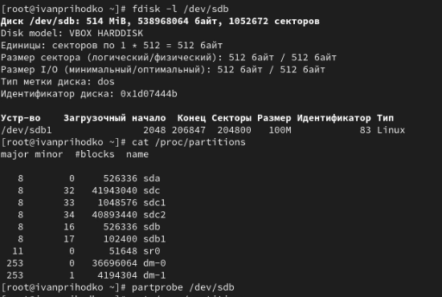

## Создание разделов

Далее создаем логический раздел для диска 2 

## Создание разделов

Проверяем наличие логического раздела

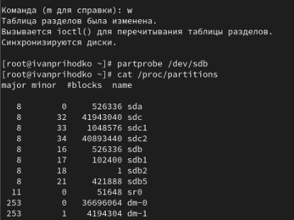

## Создание разделов

Далее создаем раздел для подкачки

## Создание разделов

Проверяем наличие разделя для подкачки 

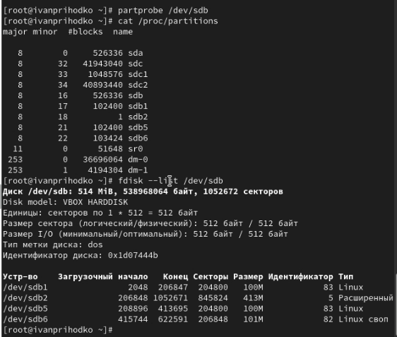

## Создание разделов

Потом форматируем диск для подкачки и проверяем наличие места

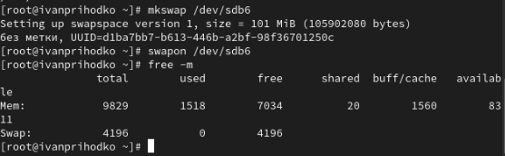

## Создание разделов

Далее создаем раздел GPT с помощью gdisk

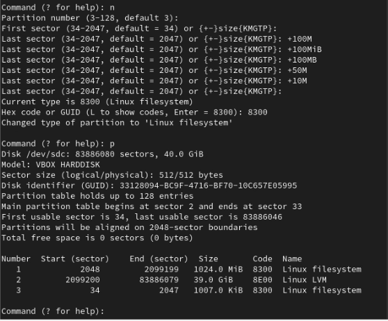

## Работа с монтированием систем

Затем форматируем файловую систему XFS и EXT4

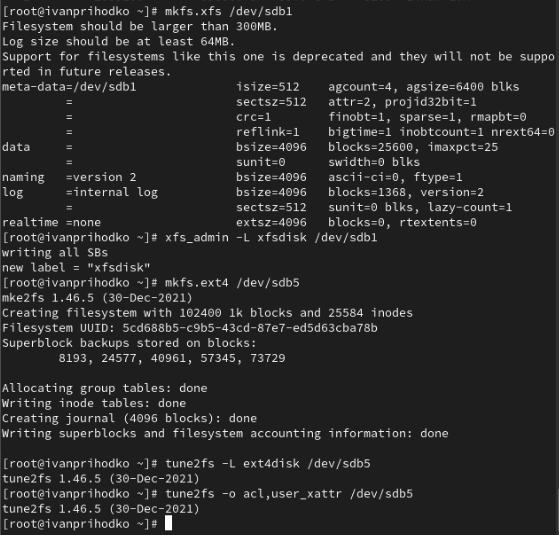

## Работа с монтированием систем

А теперь вручную примонтурем созданные разделы, после команды выведем все файловые системы

## Работа с монтированием систем

После команды раздел успешно отмонтирован

## Работа с монтированием систем

Теперь создаем папку для монтирования раздела и выводим айди нужного раздела

## Работа с монтированием систем

Далее изменим файл и впишем туда данные куда монтировать и какой раздел по айди

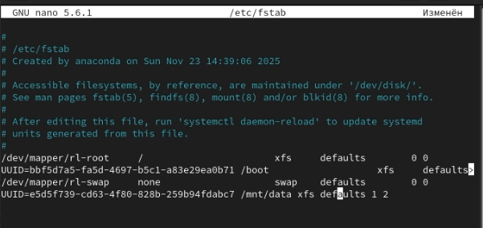

## Работа с монтированием систем

Монтируем и проверяем

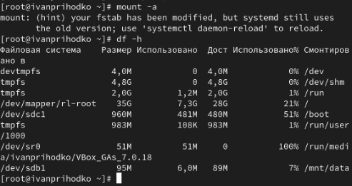

## Выводы

В ходе данной лабораторной работы были полученны навыки для создания разделов на диске и файловых систем и монтирования файловых систем.

